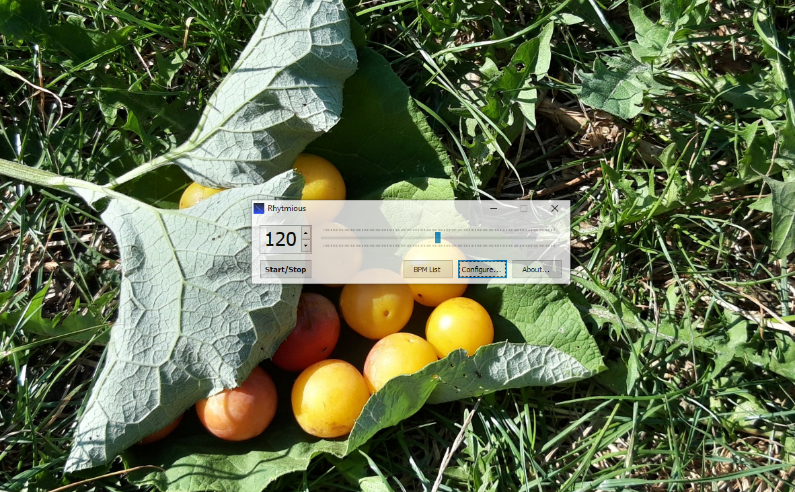

# Rhytmious

### Простенький метроном, ничего необычного

**\[[English](README.md) / [Русский](README-RU.md)\]**

---

**Rhytmious** - простой и смешной метроном для ОС Windows. Написан на C# с использованием Win32 API. Для сборки проекта требуется Visual Studio 2019.\
Проект разрабатывался мной с марта по апрель 2023 года. Исходные коды доступны на условиях [Нелицензии](UNLICENSE.txt).\
Собственно, всё :)

